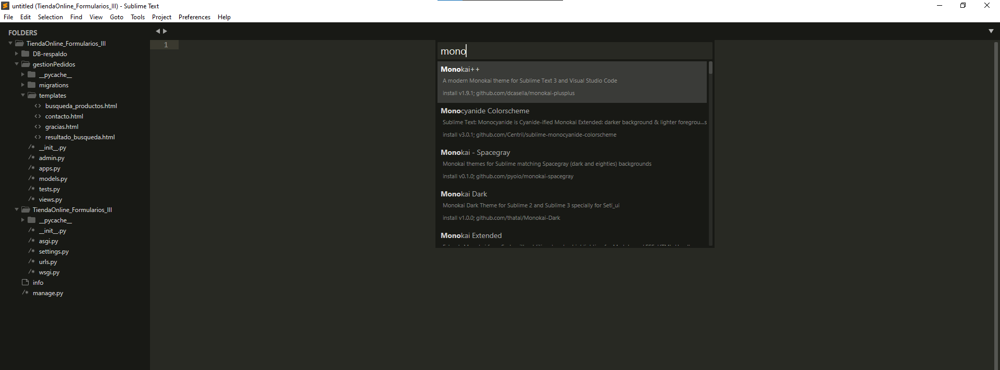

<h2 align="center">Sublime Text - Licence &nbsp;:heart:&nbsp;</h2>

## Install Package Control

Instalacion de Paquete [Command Palette](https://packagecontrol.io/installation).<br>


_Open the command palette_

```
Win/Linux: ctrl+shift+p, Mac: cmd+shift+p
```

- Adaptative Sublime-Theme
Tema oscuro para interfaz de Sublime Text

- Monokai Dark


